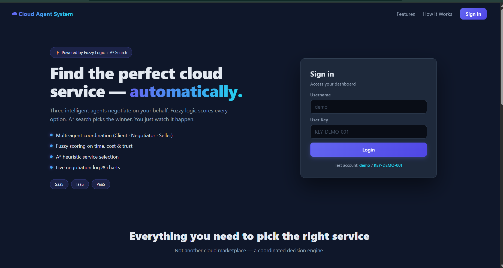
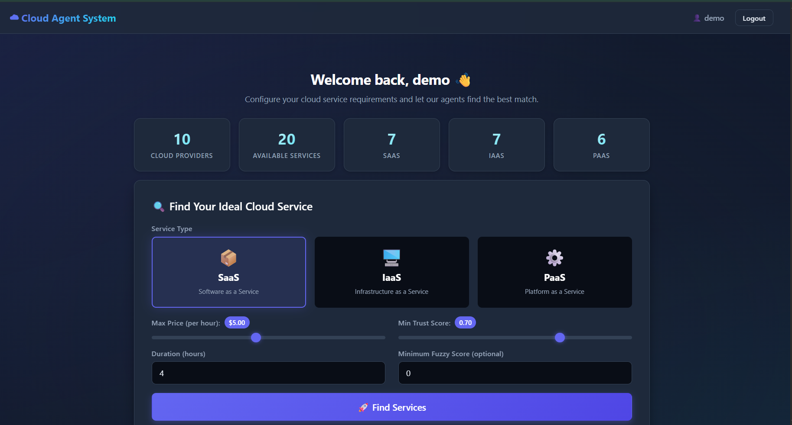
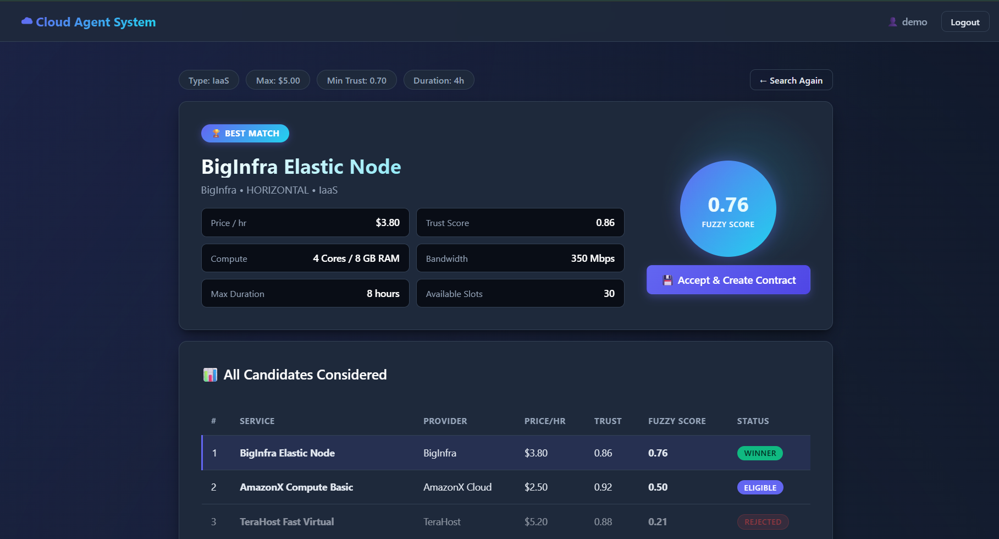

# ☁ Multi-Agent Cloud Service Categorization System

> Multi-Agent Cloud Service System — a Flask web app where three AI agents (Client, Negotiator, Seller) automatically find the best cloud service for a user. Fuzzy logic scores each candidate by time, cost, and trust; A* search picks the winner. Users see the live agent negotiation and get a contract.

---

## 📖 Overview

Selecting the right cloud service among dozens of competing providers (such as AWS, Google Cloud, Azure, and private vendors) presents significant challenges for consumers. Offerings differ widely in computational capacity, pricing models, quality of service (QoS), and trustworthiness. Manually evaluating these multidimensional trade-offs is tedious and inefficient.

This project implements an autonomous Multi-Agent Cloud Service System where software agents collaborate to streamline cloud brokering. A **Client Agent** captures user preferences, a **Negotiator Agent** gathers and evaluates service offerings, and a **Seller Agent** confirms availability and commits to terms.

To handle soft constraints and natural human preferences (such as desiring a "fast, cheap, and reliable" service), a **Fuzzy Logic Inference Engine** evaluates candidate desirability scores. Then, an informed **A\* Search Algorithm** explores the solution space, penalizing high operational costs while maximizing desirability to identify the globally optimal service match.

The entire negotiation flow is surfaced in real time through an interactive, modern web interface, providing total visibility into the multi-agent decision-making process.

---

## 🎯 Features

- **Multi-Agent Coordination**: Autonomous distributed flow between `ClientAgent`, `NegotiatorAgent`, and `SellerAgent`.
- **Fuzzy Logic Inference**: Triangular membership functions modeling `time`, `cost`, and `trust` into a unified desirability score.
- **A\* Heuristic Search**: Informed search algorithm utilizing cost penalties $g(n)$ and desirability heuristics $h(n)$ for best-match selection.
- **Real-Time Agent Conversation Log**: Streaming playback of agent dialogue and negotiation steps.
- **Three-Tier Cloud Categorization**: Structured support for **SaaS**, **IaaS**, and **PaaS** offerings.
- **Automated Contract Generation**: Instant SLA contract generation and persistent storage in SQLite.
- **Interactive Dashboard & Charts**: Real-time DB stats, dynamic parameter sliders, horizontal score comparisons, and type distribution charts powered by Chart.js.

---

## 📸 Application Screenshots

### 1. Authentication & Sign-in Portal
*Sleek, modern dark-themed entry point featuring quick test credentials for effortless evaluator sign-in and assessment.*



---

### 2. Interactive Cloud Search Dashboard
*Real-time provider and service inventory statistics, interactive category selector tiles (SaaS / IaaS / PaaS), and dynamic budget, duration, and trust range sliders.*



---

### 3. Multi-Agent Selection & Negotiation Results
*Autonomous agent decision payoff screen presenting the winning service hero card (with 0.76 fuzzy desirability rating), candidate evaluation matrix with status badges, comparative analytics, and streaming multi-agent dialogue log.*



---

## 🏗 Architecture

```text
+-------------------------------------------------------------------------------+
|                                  USER / BROWSER                               |
|                  (Vanilla HTML5 + Modern CSS + JavaScript + Chart.js)          |
+---------------------------------------+---------------------------------------+
                                        | HTTP / JSON API
                                        v
+-------------------------------------------------------------------------------+
|                                FLASK BACKEND (app.py)                         |
|      [/login]            [/dashboard]            [/results]        [/api/search]
+---------------------------------------+---------------------------------------+
                                        |
                                        v
                    +---------------------------------------+
                    |              ClientAgent              |
                    |  (Captures constraints & preferences) |
                    +-------------------+-------------------+
                                        |
                                        v
                    +---------------------------------------+
                    |            NegotiatorAgent            |
                    |        (Orchestrates Selection)       |
                    +---------+-------------------+---------+
                              |                   |
               +--------------+                   +--------------+
               v                                                 v
    +--------------------+                             +--------------------+
    | Fuzzy Logic Engine |                             |  A* Search Engine  |
    |   (scikit-fuzzy)   |                             |    (search/astar)  |
    | Inputs: time, cost |                             | g(n) = Cost Penalty|
    |         trust      |                             | h(n) = Desirability|
    | Output: score 0..1 |                             | f(n) = -(h - 0.3g) |
    +--------------------+                             +--------------------+
               |                                                 |
               +----------------------+--------------------------+
                                      |
                                      v
                    +---------------------------------------+
                    |              SellerAgent              |
                    |    (Confirms ownership & pricing)     |
                    +-------------------+-------------------+
                                        |
                                        v
+-------------------------------------------------------------------------------+
|                          SQLITE DATABASE (cloud_agents.db)                     |
|         [users]      [providers]      [services]      [contracts]      [agent_logs]
+-------------------------------------------------------------------------------+
```

---

## 🧰 Tech Stack

- **Backend**: Python 3.10+, Flask 3.0.0
- **Database**: SQLite3 (Native Python library, zero ORM overhead)
- **AI & Numerical Engine**: `scikit-fuzzy 0.4.2`, `numpy 1.26.4`
- **Visualization (Headless)**: `matplotlib 3.8.0` (membership function PNG export)
- **Search Algorithm**: Custom Python $A^*$ implementation using `heapq`
- **Frontend**: Vanilla HTML5, CSS3 (Modern Dark SaaS Theme), Vanilla JavaScript (ES6+)
- **Client Charts**: Chart.js v4.4.1 (via CDN)
- **Tooling**: Pure Python virtual environment, no npm or frontend build steps required

---

## 📁 Project Structure

```text
cloud-agent-system/
├── assets/                    # Project screenshots and visual walkthrough media
├── app.py                     # Flask web server, page routes & REST API endpoints
├── requirements.txt           # Python dependency specifications
├── seed_data.py               # Database reseed script (10 providers, 20 services, 1 user)
├── start.bat                  # One-click Windows application launcher
├── .gitignore                 # Version control exclusions
├── README.md                  # Project documentation & reference manual
├── DEMO_SCRIPT.md             # 5-minute viva demonstration script
├── PROJECT_REPORT.md          # Comprehensive academic report outline
├── agents/                    # Multi-agent coordination module
│   ├── __init__.py            # Module exports (ClientAgent, SellerAgent, NegotiatorAgent)
│   ├── client_agent.py        # Captures user requirements & confirms contracts
│   ├── negotiator_agent.py    # Brain agent: queries DB, invokes Fuzzy + A*, coordinates deals
│   └── seller_agent.py        # Validates service ownership & confirms pricing
├── database/                  # SQLite database access layer
│   ├── __init__.py
│   └── db.py                  # Database class with connection pooling and helper methods
├── fuzzy/                     # Fuzzy inference system
│   ├── __init__.py
│   └── fuzzy_engine.py        # skfuzzy Antecedent/Consequent, rules & plot generator
├── search/                    # Heuristic search algorithm
│   ├── __init__.py
│   └── astar.py               # Custom A* search implementation and decision explanation
├── templates/                 # Server-rendered HTML5 templates
│   ├── login.html             # Authentication & user registration interface
│   ├── dashboard.html         # Main portal, system statistics & search configuration
│   └── results.html           # Winner hero card, candidate table, charts & conversation log
├── static/                    # Frontend client assets
│   ├── style.css              # Global design system, glassmorphism & responsive layout
│   ├── script.js             # Client-side API integration, DOM updates & Chart.js logic
│   └── plots/                 # Generated fuzzy membership function PNG plots
└── instance/                  # SQLite storage directory
    └── cloud_agents.db        # SQLite database file
```

---

## 🚀 Setup Instructions

### 1. Clone or Open the Project
Open a terminal in the `cloud-agent-system` directory:
```bash
cd cloud-agent-system
```

### 2. Create and Activate Virtual Environment

- **Windows (PowerShell)**:
  ```powershell
  python -m venv venv
  .\venv\Scripts\Activate.ps1
  ```
- **Windows (Command Prompt)**:
  ```cmd
  python -m venv venv
  venv\Scripts\activate.bat
  ```
- **Mac / Linux**:
  ```bash
  python3 -m venv venv
  source venv/bin/activate
  ```

### 3. Install Dependencies
```bash
pip install -r requirements.txt
```

### 4. Seed the Database
```bash
python seed_data.py
```

### 5. Start the Application
```bash
python app.py
```

### 6. Access the System
Open your browser and navigate to:
**`http://localhost:5000`**

Log in using the pre-seeded credentials:
- **Username**: `demo`
- **User Key**: `KEY-DEMO-001`

*(Or register a new account on the login page to receive an auto-generated key).*

---

## 🎬 Demo Walkthrough

1. **Log in**: Sign in as `demo` / `KEY-DEMO-001` at `/login`.
2. **Review System Stats**: View the live breakdown across 10 cloud providers and 20 categorized services on the Dashboard.
3. **Configure Criteria**: Select the **SaaS** tile, set **Max Price** to `$5.00/hr`, and **Min Trust** to `0.75`.
4. **Trigger Agents**: Click **"🚀 Find Services"**. Watch the animated loading state as `ClientAgent` &rarr; `NegotiatorAgent` &rarr; `Fuzzy` &rarr; `A*` &rarr; `SellerAgent` coordinate.
5. **Analyze Results**:
   - Inspect the **Winner Hero Card** featuring **DataForge AI OCR API** with its fuzzy score ($0.765$).
   - Review the **Candidates Table** showing winning, eligible, and rejected rows.
   - Examine the **Fuzzy Score Bar Chart** and **Type Distribution Doughnut Chart**.
   - Read the streaming **Agent Conversation Log** showing exact reasoning for every filtered candidate.
   - Click **"💾 Accept & Create Contract"** to confirm the SLA into SQLite.

---

## 🔬 How It Works

### 1. Why Fuzzy Logic?
Cloud service requirements rarely operate on binary thresholds. A customer wanting a "low cost" and "high trust" service is expressing soft constraints. The system maps raw duration, price, and trustworthiness into fuzzy linguistic variables (`Low`, `High`) using triangular membership functions:
- **RULE 1**: `IF time is LOW AND cost is LOW AND trust is HIGH -> score is GOOD`
- **RULE 2**: `IF time is HIGH OR cost is HIGH OR trust is LOW -> score is BAD`

Defuzzification produces a continuous desirability score $\in [0.0, 1.0]$.

### 2. Why A\* Search?
Picking solely by the highest fuzzy score ignores the user's budget ceiling or trust floors. Our custom $A^*$ formulation evaluates:
- **Cost Penalty**: $g(n) = \frac{\text{price}}{20.0}$
- **Heuristic**: $h(n) = \text{fuzzy\_score} \times 0.7 + \text{trustworthiness} \times 0.3$
- **Evaluation Function**: $f(n) = -(h(n) - 0.3 \cdot g(n))$

Using a min-heap (`heapq`), $A^*$ guarantees finding the most cost-effective and desirable candidate within the constraint boundary.

### 3. Why Multi-Agent?
Decentralized decision-making mirrors real-world service-oriented architecture:
- **ClientAgent**: Acts on behalf of the consumer, enforcing privacy and contractual intent.
- **NegotiatorAgent**: Acts as a neutral broker, maintaining fuzzy and search algorithms.
- **SellerAgent**: Protects provider interests, verifying SLA commitments before contract binding.

---

## 📊 Sample Output

### Agent Negotiation Conversation Trace
```text
[CLIENT    ] [demo] Requested SaaS | max_price=5.0 | min_trust=0.75
[NEGOTIATOR] Received request, gathering services...
[NEGOTIATOR] Found 7 candidate services
[FUZZY     ] Scored 7 services with fuzzy engine
[ASTAR     ] Filtered to 5 of 7 services
[ASTAR     ]   - rejected: QuickCloud File Sync: trust 0.72 < min 0.75
[ASTAR     ]   - rejected: QuickCloud Project Desk: trust 0.7 < min 0.75
[SELLER    ] [DataForge] Confirming 'DataForge AI OCR API' at $3.5/hr
[NEGOTIATOR] Contract #1 created for 'DataForge AI OCR API'
[CLIENT    ] [demo] Contract #1 confirmed for 'DataForge AI OCR API'
```

---

## 👥 Authors

- **Student Name**: [Your Name]
- **Roll Number / Class**: [Your Roll Number / Class]
- **Course**: Internal Assessment Project — Academic Year 2026

---

## 📜 License

This project is licensed for educational and academic assessment purposes only.

---

## 🙏 Acknowledgements

Based on the research paper:  
*“Multiple Intelligent Agent Coordination Strategy for Categorizing and Searching Appropriate Cloud Services”* (IEEE 2017).
